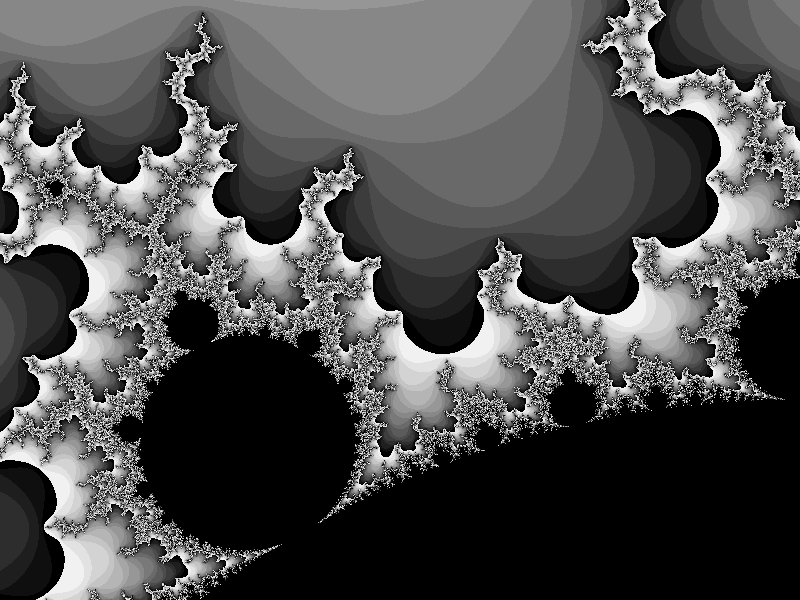
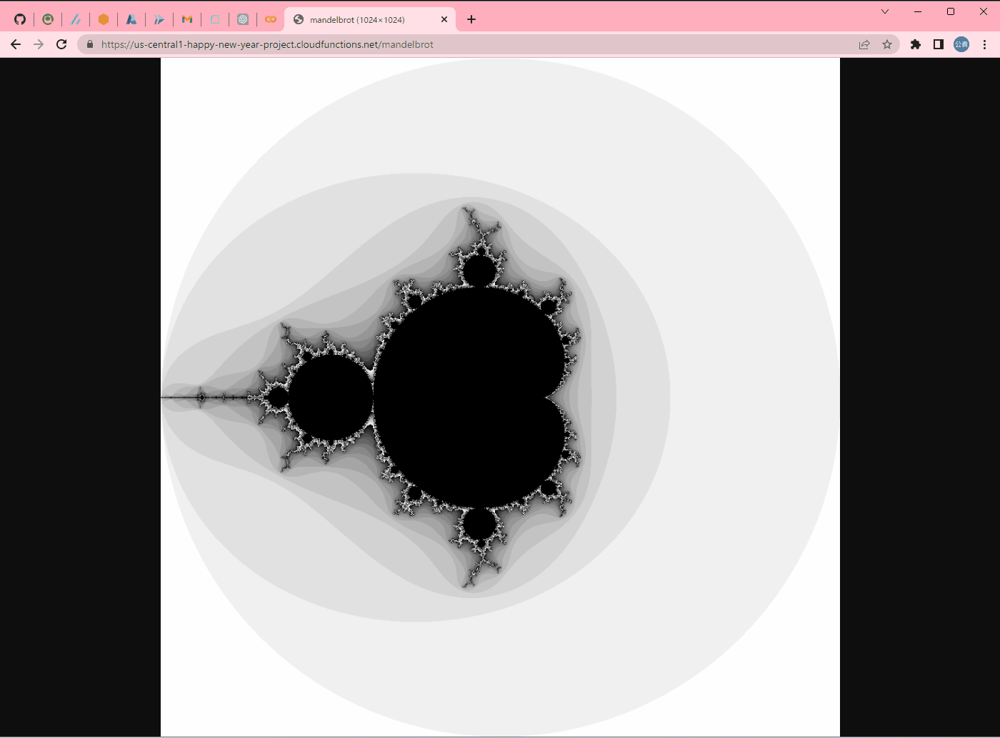

# mandelbrot-by-cloudfunc

🍒🍒🍒 `Cloud Functions`でマンデルブロ集合を描写するAPIを提供してみる。  
AWSのlambdaやAzureのFunctionsと比較すると少し開発しにくいかも、、、  

  

実際にパラメタを指定してAPIを呼んでいるGIF画像も紹介。  

  

## パラメタ

以下のパラメタが指定可能。  
FormValueを使用しているため、クエリパラメタとフォームパラメタのどちらでも指定可能。  

| パラメタ名 | 説明 | デフォルト |
| ---- | ---- | ---- |
| width | 画像サイズ(横幅) | 1024 |
| height | 画像サイズ(縦幅) | 1024 |
| xmix | 実軸最小点 | -2.0 |
| ymix | 虚軸最小点 | -2.0 |
| xmax | 実軸最大点 | 2.0 |
| ymax | 虚軸最大点 | 2.0 |
| iter | 最大反復回数 | 200 |
| thre | 発散判定閾値 | 15 |

## 補足

第二世代ではソースコードからデプロイすることができなく、手動でデプロイするしかないらしい、、、  
<https://cloud.google.com/functions/docs/deploy?hl=ja#from-cloud-storage>  

これは大変だ、、、🐧🐧🐧  
